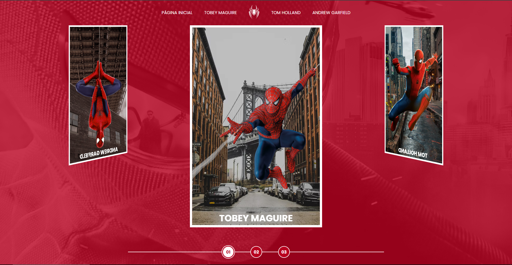
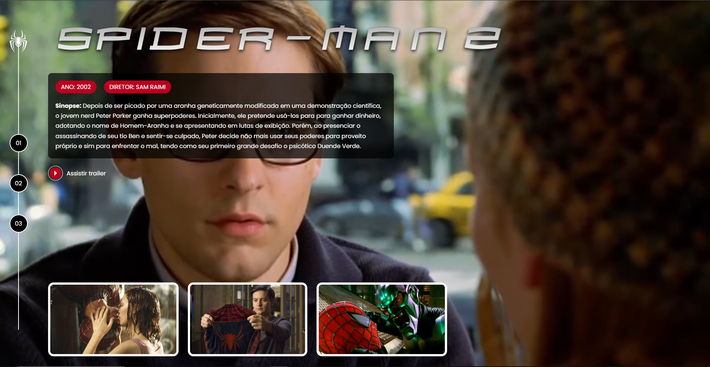

# Landing-Page-Multiverso-Spider-Man

Este projeto é parte do desafio **"Multiverso Spider-Man: Criando um Site com HTML, CSS e JavaScript"** do bootcamp **"Ri Happy - Front-end do Zero"** na **DIO.me**. O site apresenta uma página interativa onde os usuários podem explorar os filmes do Homem-Aranha utilizando um carrossel dinâmico.

---

## 📖 Sobre  

O site foi desenvolvido para reforçar habilidades fundamentais de **HTML**, **CSS**, e **JavaScript**, oferecendo uma experiência fluida de navegação e seleção. O carrossel permite aos usuários navegar por diferentes filmes do Homem-Aranha de diferentes atores.  

O projeto combina elementos visuais marcantes com interatividade e boas práticas de desenvolvimento front-end.  

---

## 🚀 Tecnologias Utilizadas  

- **HTML**: Estruturação semântica das seções do site.  
- **CSS**:  
  - Animações suaves e transições para o carrossel.  
  - Estilização moderna e utilização de **Flexbox**.  
- **JavaScript**:  
  - Controle dinâmico do carrossel para seleção de filmes.  
  - Manipulação do DOM.  
  - Animações e interações baseadas em eventos do usuário.  

---

## 🖥 Preview  

## 🔗 Links Úteis
- [Bootcamp na DIO](https://web.dio.me/track/coding-future-front-end-do-zero)
